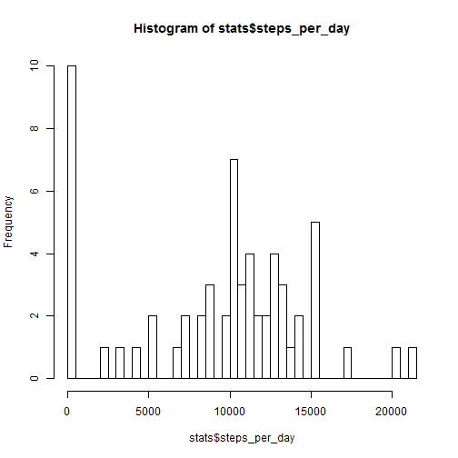
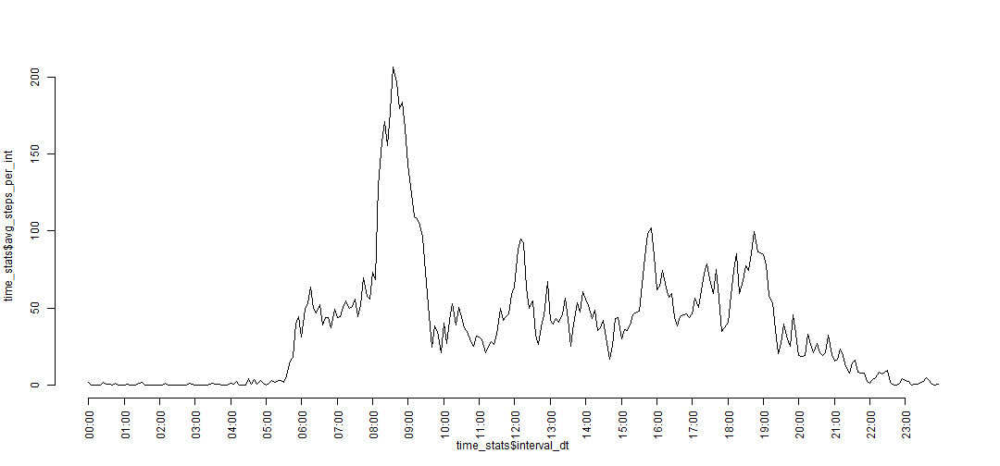
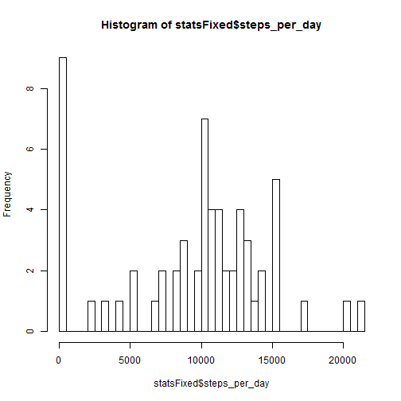
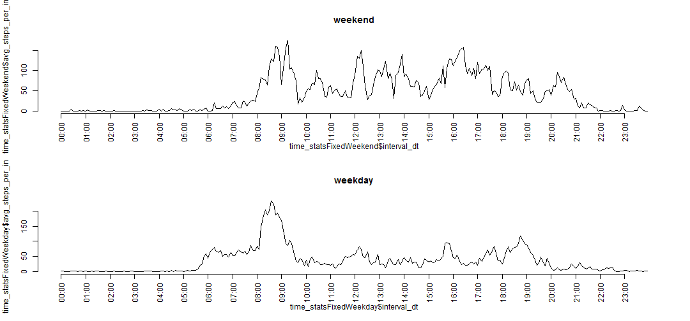

## Loading and preprocessing the data


```r
unzip("activity.zip")
data <- read.csv("activity.csv")
summary(data)
```

```
##      steps                date          interval     
##  Min.   :  0.00   2012-10-01:  288   Min.   :   0.0  
##  1st Qu.:  0.00   2012-10-02:  288   1st Qu.: 588.8  
##  Median :  0.00   2012-10-03:  288   Median :1177.5  
##  Mean   : 37.38   2012-10-04:  288   Mean   :1177.5  
##  3rd Qu.: 12.00   2012-10-05:  288   3rd Qu.:1766.2  
##  Max.   :806.00   2012-10-06:  288   Max.   :2355.0  
##  NA's   :2304     (Other)   :15840
```

```r
library(plyr)
```

```
## Warning: package 'plyr' was built under R version 3.1.2
```

```r
data$d1 <- sprintf("%04d", data$interval)
data$interval_dt <- strptime(data$d1, "%H%M" )
data$date_dt <- strptime(data$date, "%Y-%m-%d")
data$d1 <- NULL

stats <- ddply(data, .(date), summarise, 
               "steps_per_day" = sum(steps, na.rm = T))

time_stats <- ddply(data, .(interval_dt), summarise,
                "avg_steps_per_int" = mean(steps, na.rm = T))

print(head(data))
```

```
##   steps       date interval         interval_dt    date_dt
## 1    NA 2012-10-01        0 2014-12-14 00:00:00 2012-10-01
## 2    NA 2012-10-01        5 2014-12-14 00:05:00 2012-10-01
## 3    NA 2012-10-01       10 2014-12-14 00:10:00 2012-10-01
## 4    NA 2012-10-01       15 2014-12-14 00:15:00 2012-10-01
## 5    NA 2012-10-01       20 2014-12-14 00:20:00 2012-10-01
## 6    NA 2012-10-01       25 2014-12-14 00:25:00 2012-10-01
```

```r
#print(data)


#print(class(data$interval_dt[1]))

#print(stats)

#print(head(time_stats))
```

## What is mean total number of steps taken per day?

```r
hist(stats$steps_per_day, breaks=
       seq(0,max(stats$steps_per_day)+500, by=500))
```

 

```r
mean_per_day <- mean(stats$steps_per_day, na.rm=T)
median_per_day <- median(stats$steps_per_day, na.rm=T)
```

Mean value of steps per day is 9354.2295082.
Median value of steps per day is 10395.


## What is the average daily activity pattern?


```r
startTime <- strptime("00:00", "%H:%M")
endTime <- strptime("23:55", "%H:%M")

plot(time_stats$interval_dt, time_stats$avg_steps_per_int, 
     type="l", axes = F)
axis(side = 2)
axis.POSIXct(side = 1, las = 2, at = seq(startTime, endTime, by="hour"))
```

 

```r
steps_max <- max(time_stats$avg_steps_per_int)
time_int_max <- time_stats$interval_dt[time_stats$avg_steps_per_int == steps_max]

time_int_max_fmt <- format(time_int_max, "%H:%M")
```

Maximum average number of steps per day is 206.1698113 for interval 08:35.


## Imputing missing values

Fixing NA values with a very simple strategy - by replacing them with mean value for this time period. 


```r
dataFixed <- data

for(i in 1:length(dataFixed$steps))
{
  if(is.na(dataFixed$steps[i]))
    dataFixed$steps[i] <- time_stats$avg_steps_per_int[i]
}

statsFixed <- ddply(dataFixed, .(date), summarise, 
               "steps_per_day" = sum(steps, na.rm = T))

time_statsFixed <- ddply(dataFixed, .(interval_dt), summarise,
                "avg_steps_per_int" = mean(steps, na.rm = T))

hist(statsFixed$steps_per_day, breaks=
       seq(0,max(stats$steps_per_day)+500, by=500))
```

 

```r
mean_per_day_fixed <- mean(statsFixed$steps_per_day, na.rm=T)
median_per_day_fixed <- median(statsFixed$steps_per_day, na.rm=T)

#print(head(dataFixed))
```
Mean value of steps per day with fixed NA values is 9530.7244046 while original mean value is 9354.2295082.  
Median value of steps per day with fixed NA values is 1.0439 &times; 10<sup>4</sup> while original median value is 10395.  


## Are there differences in activity patterns between weekdays and weekends?


```r
dataFixed$day <- dataFixed$date_dt$wday

weekendsData <- dataFixed[dataFixed$day == 0 | dataFixed$day == 6, ]
weekdayData <- dataFixed[dataFixed$day != 0 & dataFixed$day != 6, ]

time_statsFixedWeekend <- ddply(weekendsData, .(interval_dt), summarise,
                "avg_steps_per_int" = mean(steps, na.rm = T))

time_statsFixedWeekday <- ddply(weekdayData, .(interval_dt), summarise,
                "avg_steps_per_int" = mean(steps, na.rm = T))

par(mfrow = c(2,1))
plot(time_statsFixedWeekend$interval_dt, time_statsFixedWeekend$avg_steps_per_int, type="l", axes = F, main="weekend")
axis(side = 2)
axis.POSIXct(side = 1, las = 2, at = seq(startTime, endTime, by="hour"))

plot(time_statsFixedWeekday$interval_dt, time_statsFixedWeekday$avg_steps_per_int, type="l", axes = F, main="weekday")
axis(side = 2)
axis.POSIXct(side = 1, las = 2, at = seq(startTime, endTime, by="hour"))
```




